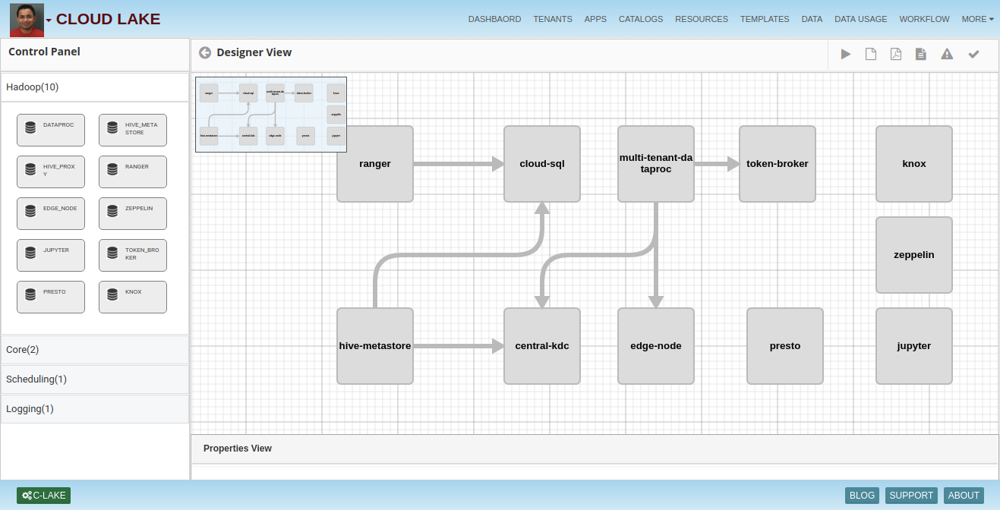

# Cloud-Lake

## Introduction
Cloud Lake allows provisioning of secure entrprise data lake easy on different cloud platforms like AWS, GCP and Azure.

## Security
Cloud Lake solution hides the complexity of building enterprise data lake solution by plumbing different services together seamlessly.

## Pages

### Designer
Designer allows drag and drop of components to design the data lake. Operations team can deploy the components from the designer tool.

### Script
Cloud Lake solution allows user to view and download the cloud script

### Template
Cloud Lake solution allows to create template for defining designer and cloud script

### Dashboard 
Dashboard is responsible for showing current status of solution like resource summary, Planned maintenance

### Data Usage 

### Catalogs 
Cloud Lake solutions provide catalogs which contain basic categories like Compute, Container, Storage, AI, Analytics etc.

### Tenants 
Tenants bascically responsible for creating APP by using resources provided by cloud lake solution.

### Resources 
Cloud Lake solution create the resources from compute, container, storage, AI, Analytics etc.

### Workflow 

To learn more, check out [http://www.insightlake.com/cloud-lake.html](http://www.insightlake.com/cloud-lake.html)

Installation
------
* Download or clone the repository. 
* Run bin/insightlake command.
* Open browser with URL as http://localhost:9494/
* Change configuration in /conf folder to set different ports
* By default H2 database is used, you can change the database details in jdbc.properties file

Installation using docker 
------
* Download or clone the repository. 
* cd /docker
* Run `docker-compose -f docker-compose.yaml up --build`
* Open browser with URL as http://localhost:9494/insightlake/

License
------
InsightLake Cloud Lake is closed source but distributed to be used freely. Please contact contact@insightlake.com for details.

Getting Help
----------

You can get help easily :
Community - Google Groups
Slack Channel
Twitter
Facebook
Email: contact@insightlake.com
